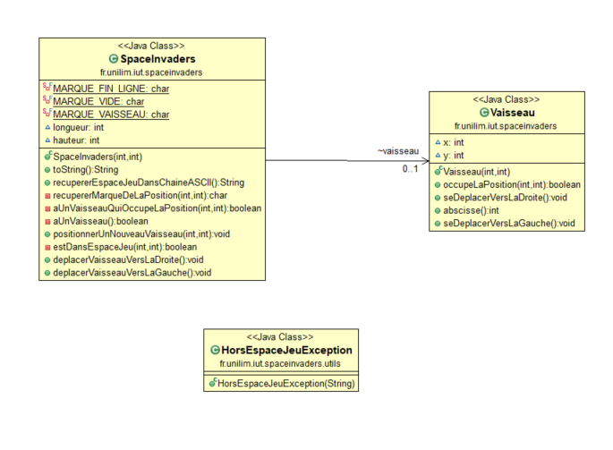
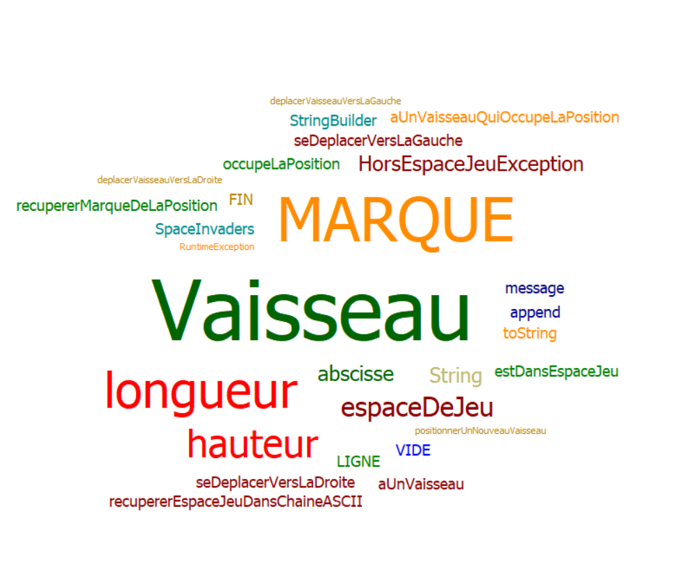
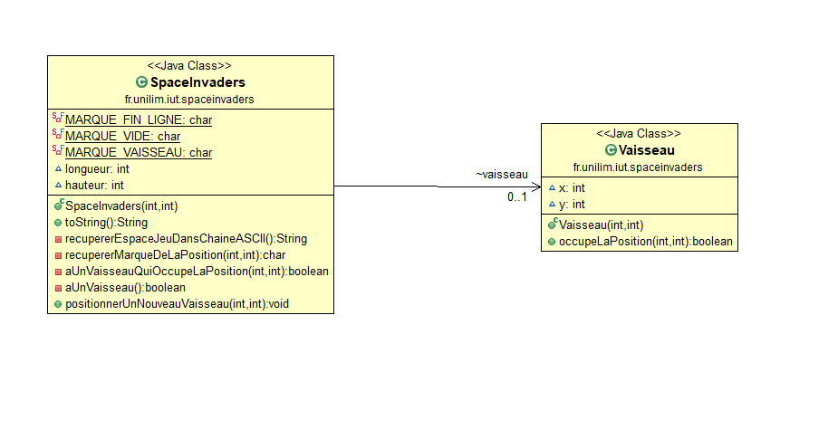
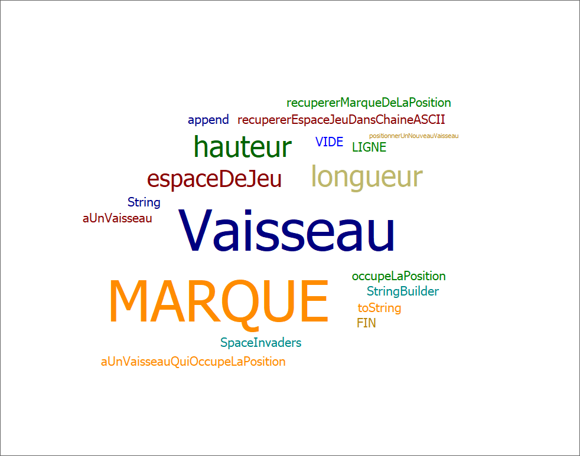

# spaceinvaders

## Semaine 3 du 10 au 14 mai 

###Fonctionnalitées réaliser

###Fonctionalité numéro 1 :

- Etape 3 : Déplacer le vaisseau vers la droite dans l'espace de jeu  
Le vaisseau se déplace d'un pas vers la droite 
Si le vaisseau se trouve sur la bordure droite de l'espace de jeu, le vaisseau doit rester immobile (aucun déplacement, aucune exception levée : le vaisseau reste juste à sa position actuelle).

- Etape 4  : Déplacer le vaisseau vers la gauche dans l'espace de jeu  
Le vaisseau se déplace d'un pas vers la gauche 
Si le vaisseau se trouve sur la bordure gauche de l'espace de jeu, le vaisseau doit rester immobile (aucun déplacement, aucune exception levée : le vaisseau reste juste à sa position actuelle). (WIP)

### Fonctionnalités en cours d'implémentation : 
- Etape 4

### Diagramme de classe : 

### Nuage de mots :

## Semaine 2 du 26 au 1mai 

### Fonctionalitées réalisées

### Fonctionnalité numéro 1 : déplacer le vaisseau (non terminé).

- Etape 1 : Créer un espace de jeu  
Un espace de jeu est créé aux dimensions données (2D) 
Cet espace de jeu est vide.

- Etape 2 : Positionner un nouveau vaisseau.
On créer ainsi un vaisseau, le vaisseau est positionné aux coordonnées demandé
Si un nouveau vaisseau essaye d’être positionné en dehors des limites de l’espace jeu, alors une exception devra être levée.
 Les contraintes :
La position souhaitée est transmise par ses coordonnées x et y.
Le coin supérieur gauche de l’espace jeu (point en haut à gauche) a pour coordonnées (0,0)
La taille du vaisseau est réduite pour l'instant à son minimum.

### Fonctionnalités en cours d'implémentation : 
- Etape 2

### Diagramme de classe : 

### Nuage de mots :

### Glossaire

* **Vaisseau** :  véhicule commandé par le joueur, pouvant se déplacer de droite à gauche et ayant la possibilité de lancer des missiles destinés à détruire le(s) envahisseurs.

